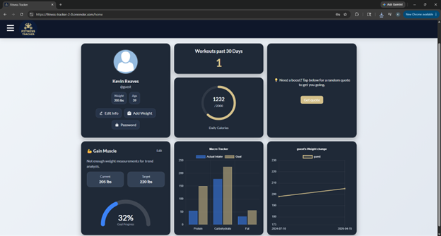

# Fitness Tracker

Fitness Tracker is a full-stack web application that allows users to track workouts, log meals, and visualize fitness progress through an interactive dashboard.

This project is a complete rebuild of my original full-stack React application, focused on improving UI/UX, state management, and overall application structure.

### Live view

### Preview

#### v3.0 (current)

).gif>)

.gif>)

.gif>)

#### v2.0 (Previous)

.gif>)

.gif>)

.gif>)

## Features

- 🏋️ Workout Journal – build and track workouts with sets, reps, and weights
- 🍽 Food Diary – log meals and track daily calorie intake
- 📊 Dashboard – visualize workouts, calories, and progress with charts
- 🔐 Authentication – secure login and user-specific data
- 💡 Motivational Quotes – fetch and display dynamic quotes

## Improvements from Version 2

- Refactored component structure for better scalability
- Rebuilt UI with a consistent design system
- Improved state management across pages
- Enhanced responsiveness for mobile and tablet
- Added data visualizations using Chart.js
- Cleaned up inline styles and centralized CSS

## Built with

- React
- Semantic HTML5 markup
- CSS3
- Chart.js
- JavaScript
- Express
- PostgreSQL
- Dropbox
- Bcrypt
- Multiple APIs

## Getting Started

### Frontend

cd client
npm install
npm start

### Backend

cd server
npm install
npm run dev

#### v1.0 (Oldest)

